# desktop chatai plus

[](https://github.com/danger-dream/desktop-chatai-plus)

desktop chatai plus 是一个高效、轻量级的桌面版AI工具，为用户提供了一个统一、便捷的界面，实现多个LLM平台的即时交互。

## 功能特性

- **常驻内存 & 失焦隐藏 & 快捷键唤起**：保持程序在后台运行，随时恢复，高效响应。
- **简洁界面**：基于Tailwind CSS设计的清晰、简洁的用户界面。
- **多LLM交互**：在同一对话框中与多个LLM平台进行交互。
- **命令式模板**：使用\"/\"前缀快速访问常用功能，如使用自定义的Prompt、切换模型、清空对话等..
- **对话直达平台**：与LLM平台直接交互，无需经过任何第三方服务器。
- **数据保障**：对话数据仅保存在本地，保障用户隐私。
- **即将到来的功能**：web检索、图文对话、文档问答、图片生成、语音交互等。

## 截图
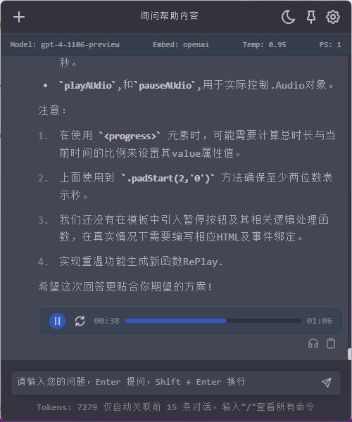
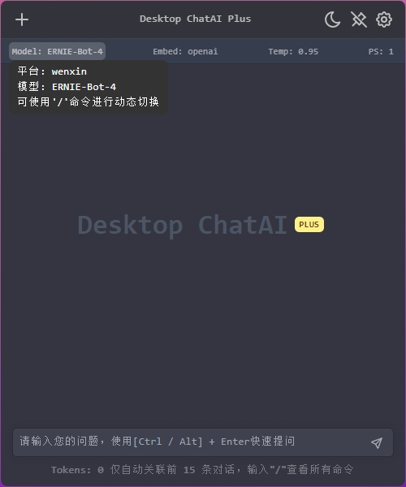
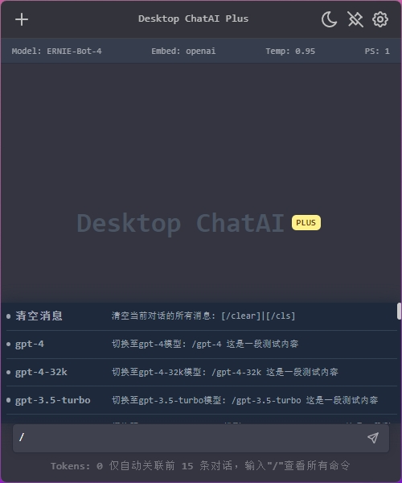
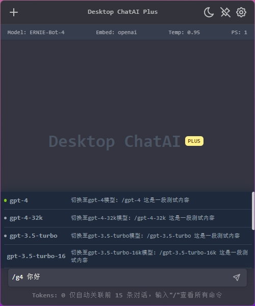
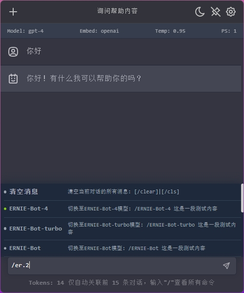
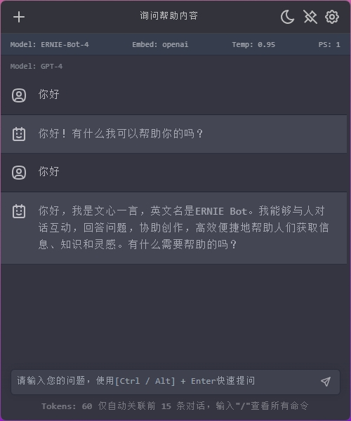
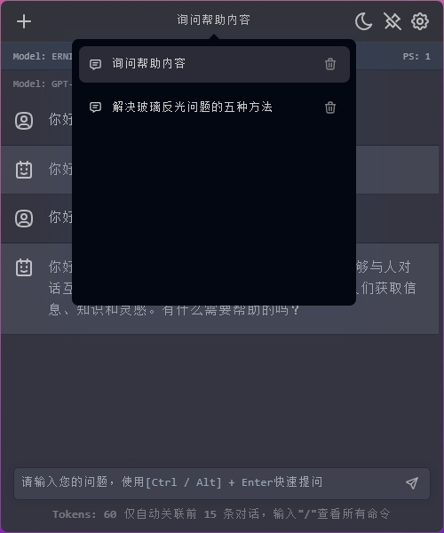
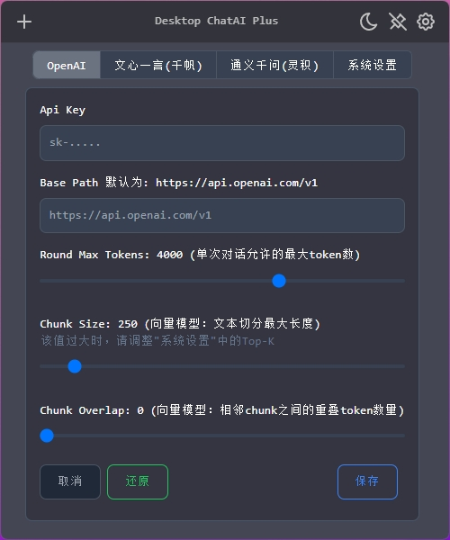
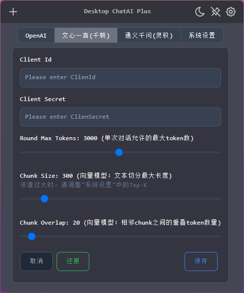
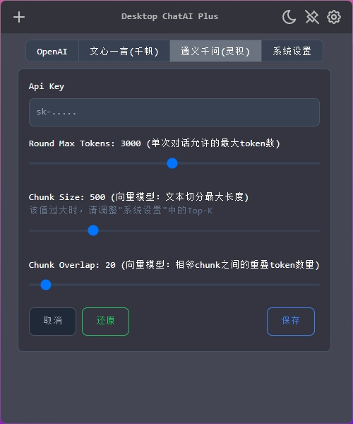
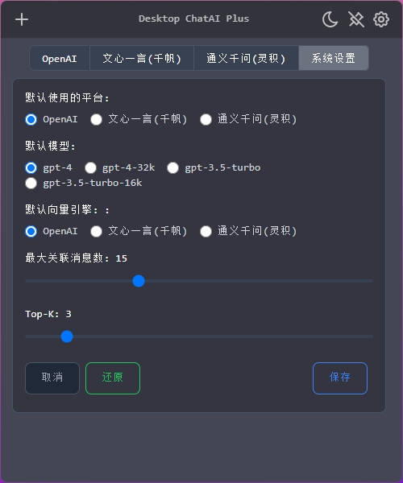


## 项目背景
在使用LLM的过程中，各家平台有不同的侧重点。 每次切换不同网页也比较麻烦，且经常遇到需要重新登录的情况。虽然社区有人开发过类似的项目，但大多是web项目。开发desktop chatai plus的主要目的是常驻内存，需要时立马打开并辅助解决问题。


## 源码运行

```bash
# 1. 克隆项目到本地
git clone https://github.com/danger-dream/desktop-chatai-plus.git

# 2. 安装依赖
cd desktop-chatai-plus

npm install

# 3. 运行
npm run dev
```

## 啰嗦的..
- 没做过多的组件拆分，感觉没必要，就这么点东西
- 放弃了UI库，前端真不熟，用了看着又不满意
- 依赖做到极简了，markdown那堆插件和tabler-icon会想办法去掉
